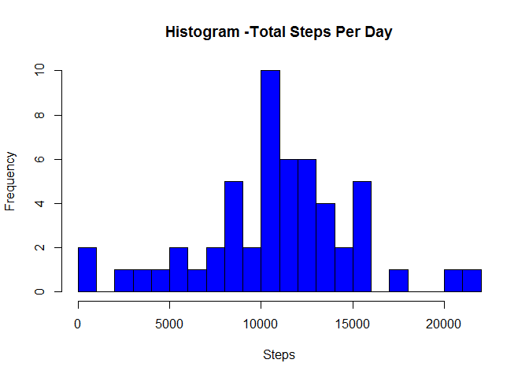
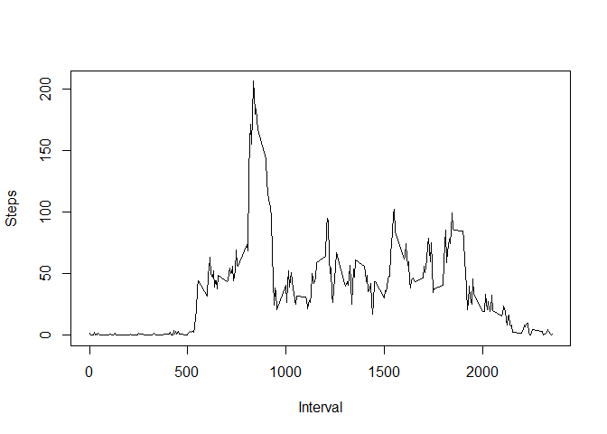
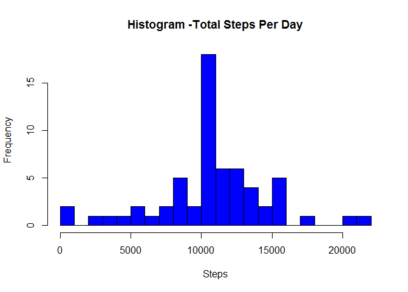
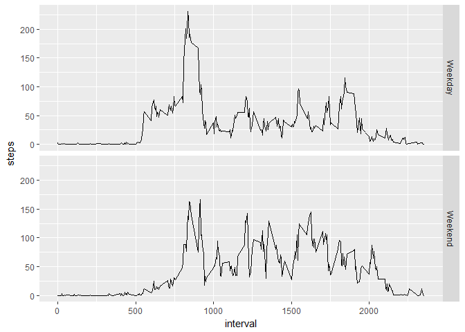

Context of Study
================

This assignment uses data from a personal activity monitoring device.
The device collects data at 5 minute intervals through out the day and
spans across two months of data from an anonymous individual collected
during months of October and November, 2012. The number of steps taken
in 5 minute intervals are recorded each day.

The variables included in this dataset are:

-   steps: Number of steps taking in a 5-minute interval (missing values
    are coded as NA)

-   date: The date on which the measurement was taken in YYYY-MM-DD
    format

-   interval: Identifier for the 5-minute interval in which measurement
    was taken The dataset is a comma-separated-value (CSV) file and
    there are a total of 17,568 observations.

Reading the dataset from working directory:
===========================================

    tabular<-read.csv("~/R/Reproducible Research/repdata_data_activity/activity.csv",header=TRUE)

Printing summary stats

    summary(tabular)

    ##      steps                date          interval     
    ##  Min.   :  0.00   2012-10-01:  288   Min.   :   0.0  
    ##  1st Qu.:  0.00   2012-10-02:  288   1st Qu.: 588.8  
    ##  Median :  0.00   2012-10-03:  288   Median :1177.5  
    ##  Mean   : 37.38   2012-10-04:  288   Mean   :1177.5  
    ##  3rd Qu.: 12.00   2012-10-05:  288   3rd Qu.:1766.2  
    ##  Max.   :806.00   2012-10-06:  288   Max.   :2355.0  
    ##  NA's   :2304     (Other)   :15840

1. Histogram of total number of steps taken each day
====================================================

    tabular1<-aggregate(steps~ date,tabular,sum)
    hist(tabular1$steps, xlab="Steps", main="Histogram -Total Steps Per Day", breaks=30, col="blue")

2. Mean and Median of Initial Dataset
=====================================

    mean(tabular1$steps)

    ## [1] 10766.19

    median(tabular1$steps)

    ## [1] 10765

3. Time Series Plot of the 5-minute interval (x-axis) and the average number of steps taken, averaged across all days (y-axis)
==============================================================================================================================

    tabular6<-aggregate(steps~interval,tabular,mean)
    plot(tabular6$interval,tabular6$steps, type='l', xlab="Interval", ylab="Steps")

4. Which 5-minute interval, on average across all the days in the dataset, contains the maximum number of steps?
================================================================================================================

    tabular6[which.max(tabular6$steps),]

    ##     interval    steps
    ## 104      835 206.1698

As observable, 835 interval contains the maximum number of steps.

5. Imputing missing values
==========================

There are a number of days/intervals where there are missing values
(coded as NA ). The presence of missing days may introduce bias into
some calculations or summaries of the data. Calculating and reporting
the total number of missing values in the dataset (i.e. the total number
of rows with NA s)

Counting NA's in Dataset&gt;Column 'steps'

    sum(is.na(tabular$steps))

    ## [1] 2304

Filling the missing values with the mean for interval and creating new
dataset

    library(plyr)

    ## Warning: package 'plyr' was built under R version 3.2.5

    impute.mean <- function(x) replace(x, is.na(x), mean(x, na.rm = TRUE))
    tabular_new <- ddply(tabular, ~ interval, transform, steps = impute.mean(steps))
    tabular_aggr<-aggregate(steps~ date,tabular_new,sum)

6. Histogram of the total number of steps taken each day (with filled in NA's)
==============================================================================

    hist(tabular_aggr$steps, xlab="Steps", main="Histogram -Total Steps Per Day", breaks=30,col="blue")

7. Mean and Median for filled in dataset
========================================

    mean(tabular_aggr$steps)

    ## [1] 10766.19

    median(tabular_aggr$steps)

    ## [1] 10766.19

-   Do these values differ from the estimates from the first part of the
    assignment? Yes, median has changed.

-   What is the impact of imputing missing data on the estimates of the
    total daily number of steps? There is no change in mean but median.

8.Are there differences in activity patterns between weekdays and weekends?
===========================================================================

Creating a new factor variable 'type' in the dataset with two levels --
"weekday" and "weekend" indicating whether a given date is a weekday or
weekend day.

    tabular_new$date<-as.POSIXct(tabular_new$date)
    tabular_new$day<-weekdays(tabular_new$date)
    tabular_new$type<-ifelse(tabular_new$day %in% ("Sunday"),"Weekend", ifelse(tabular_new$day %in% ("Saturday"),"Weekend","Weekday"))
    tabular_new2<-aggregate(steps~ interval+type,tabular_new,mean)

9. Panel Time-Series Plot (Steps vs interval) Facet by Day Type
===============================================================

Panel plot containing a time series plot (i.e. type = "l" ) of the
5-minute interval (x-axis) and the average number of steps taken,
averaged across all weekday days or weekend days (y-axis).

    library(ggplot2)

    ## Warning: package 'ggplot2' was built under R version 3.2.5

    ggplot(tabular_new2, aes(x = interval, y = steps)) +
     geom_line() + facet_grid(type ~ . )

